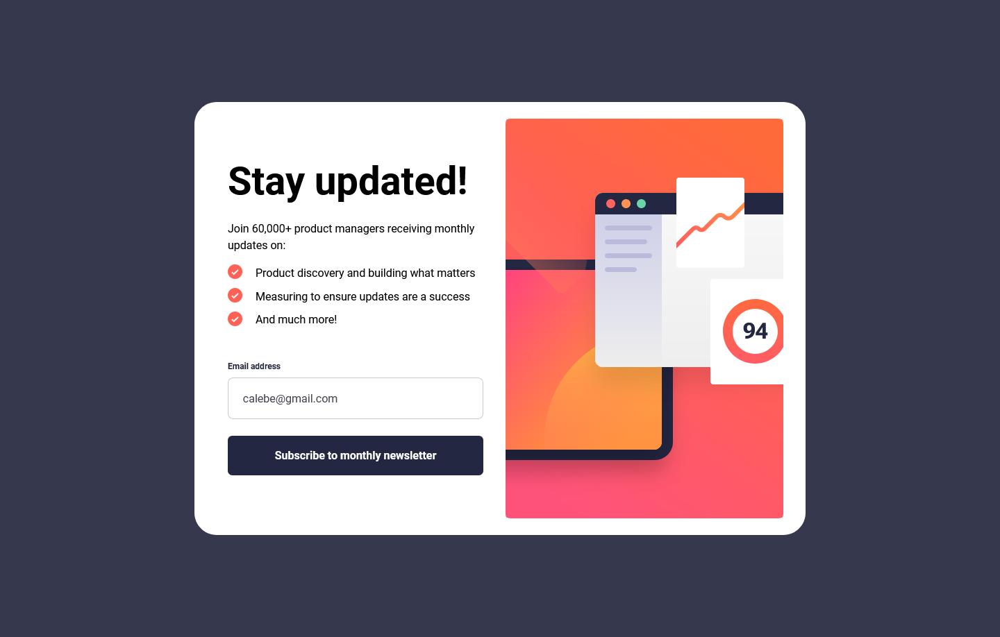

# Frontend Mentor - Newsletter sign-up form with success message

## Table of contents

- [Overview](#overview)
  - [Screenshot](#screenshot)
  - [Links](#links)
- [My process](#my-process)
  - [Built with](#built-with)
- [Author](#author)

## Overview

### Screenshot

### Links

- Live Site URL: [https://caleberl.github.io/newsletter-signup/](https://caleberl.github.io/newsletter-signup/)

## My process

### Built with

- Semantic HTML5 markup
- CSS custom properties
- CSS Grid

## Author

- Frontend Mentor - [@CalebeRL](https://www.frontendmentor.io/profile/CalebeRL)

